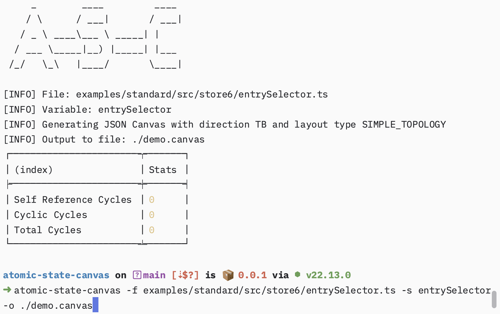
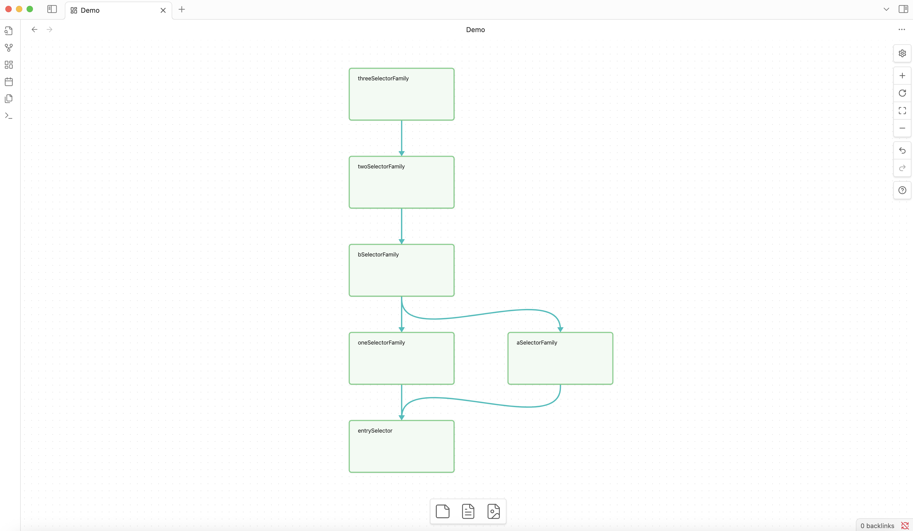
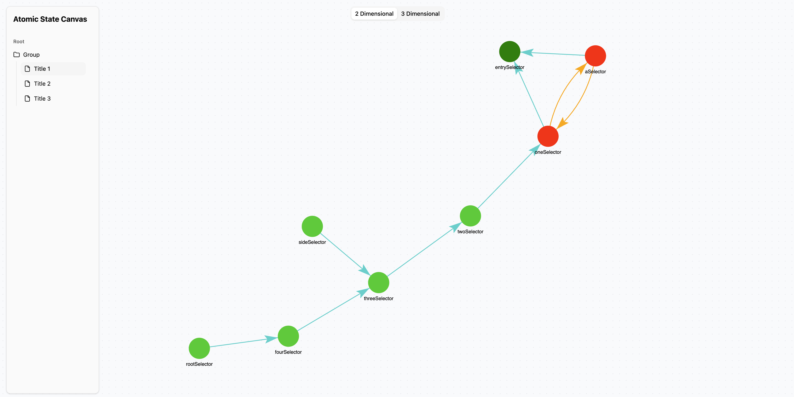
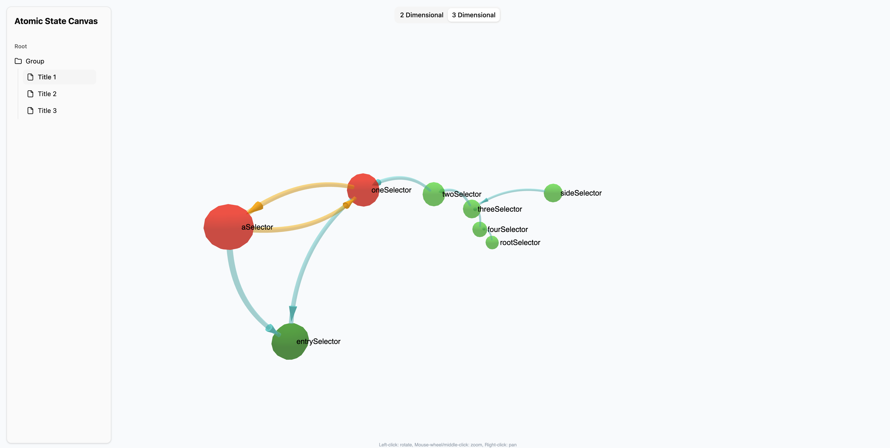

# Atomic State Canvas
This is a mono-repository that contains a collection of applications for analyzing and visualizing atomic state relationships using [JSON Canvas](https://jsoncanvas.org/) or a custom interactive "storybook"-like web application. Currently, it only supports [Recoil.js](https://recoiljs.org/) by default.

## Usage

| Application    | Description                                                                                                                                                                                                                              | Installation                                       |
|----------------|------------------------------------------------------------------------------------------------------------------------------------------------------------------------------------------------------------------------------------------|----------------------------------------------------|
| [asc-cli](./apps/asc-cli)        | CLI tool for visualizing atomic state relationships. It visualizes atomic state relationships using [JSON Canvas](https://jsoncanvas.org/)                                                                                               | npm install @atomic-state-canvas/asc-cli -g        |
| [asc-viewer-cli](./apps/asc-viewer-cli) | An interactive web application for analyzing and visualizing atomic state relationships. By launching the development tool, it looks for ".asc." files in the directory and automatically populates the atomic graphs in a "Storybook"-like experience. | npm install @atomic-state-canvas/asc-viewer-cli -D |

## Use Cases

### Asc CLI

Running CLI command to generate atomic state canvas file and summary.

Generates atomic state canvas as [JSON Canvas](https://jsoncanvas.org/) and visualized using Obsidian.

### Asc Viewer CLI

Visualize atomic state relationships in 2D.

Visualize atomic state relationships in 3D.

## Roadmap
- [ ] Support more state management libraries such as [Jotai](https://jotai.org/)
- [ ] Add support for more features in JSON Canvas such as grouping
- [ ] Better documentation
- [ ] More comprehensive unit tests
- [ ] Support for alias import file walk
